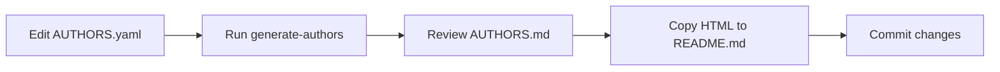

# Contributing Author Information

This document explains how to add and update author information in the project.

## Overview

Author information is managed through a centralized system:

1. **`AUTHORS.yaml`** - Source of truth for all author information
2. **`scripts/generate_author_badges.py`** - Auto-generates author badges
3. **`README.md`** - Displays author badges with Gravatar, ORCID, and contact info

## Adding a New Author

### Step 1: Edit AUTHORS.yaml

Add your information to [`AUTHORS.yaml`](../AUTHORS.yaml):

```yaml
authors:
  - name: Your Full Name
    email: your.email@institution.org
    affiliation: Your Institution Name
    orcid: 0000-0000-0000-0000  # Your ORCID (without https:// prefix)
    role: Your Role/Contribution
```

**Field Descriptions:**

- **name**: Your full name as you want it displayed
- **email**: Email address (used for Gravatar lookup and contact link)
- **affiliation**: Your institution or organization
- **orcid**: Your ORCID identifier (just the number part, e.g., `0000-0002-4512-087X`)
- **role**: Brief description of your contribution (e.g., "Lead Developer", "Testing", "Documentation")

### Step 2: Generate Author Badges

Run the generation script:

```bash
# Using pixi (recommended)
pixi run generate-authors

# Or directly with Python
python scripts/generate_author_badges.py
```

This will:
1. Read `AUTHORS.yaml`
2. Generate HTML author cards with Gravatar images
3. Update `AUTHORS.md` with both table and card formats
4. Display the output for manual copying if needed

### Step 3: Update README.md

The script outputs the HTML that should be placed in `README.md`. Simply copy the HTML card section between the comments:

```html
<!-- AUTO-GENERATED: Run `python scripts/generate_author_badges.py` to update -->
<!-- Edit AUTHORS.yaml to add/modify authors -->

<!-- PASTE GENERATED HTML HERE -->
```

## About Gravatar

Author avatars are fetched from [Gravatar](https://gravatar.com/) based on email addresses.

**To set up your Gravatar:**

1. Visit [gravatar.com](https://gravatar.com/)
2. Create an account with the same email address listed in `AUTHORS.yaml`
3. Upload your profile picture
4. Your avatar will automatically appear in the README (may take a few minutes to update)

If you don't have a Gravatar, a default identicon will be generated automatically.

## About ORCID

[ORCID](https://orcid.org/) (Open Researcher and Contributor ID) provides a persistent digital identifier for researchers.

**To get an ORCID:**

1. Visit [orcid.org](https://orcid.org/)
2. Register for a free ORCID iD
3. Add your ORCID to `AUTHORS.yaml` (just the number, e.g., `0000-0002-4512-087X`)

The badge will automatically link to your ORCID profile.

## Example Author Entry

```yaml
authors:
  - name: Paul Gierz
    email: paul.gierz@awi.de
    affiliation: Alfred Wegener Institute (AWI)
    orcid: 0000-0002-4512-087X
    role: Lead Developer, Architecture
```

This generates:

- **Gravatar**: Circular avatar linked to email
- **Name**: Displayed prominently
- **Affiliation**: Institution in smaller text
- **ORCID Badge**: Clickable icon linking to ORCID profile
- **Email Icon**: Quick mailto link
- **Role**: Italicized contribution description

## Troubleshooting

### Avatar not showing
- Make sure your email in `AUTHORS.yaml` matches your Gravatar email exactly
- Wait a few minutes for Gravatar cache to update
- Check that the generated Gravatar URL works in your browser

### ORCID link broken
- Ensure ORCID format is correct: `0000-0000-0000-0000` (four groups of four digits)
- Don't include `https://orcid.org/` prefix in `AUTHORS.yaml`

### Script fails
- Check that `AUTHORS.yaml` is valid YAML (proper indentation, no syntax errors)
- Ensure Python and dependencies are installed: `pixi install`

## Workflow Summary



## Questions?

If you have questions about contributing author information, please:
1. Check this documentation
2. Review existing entries in `AUTHORS.yaml`
3. Contact the maintainers

---

**Maintained by**: Paul Gierz <paul.gierz@awi.de>
