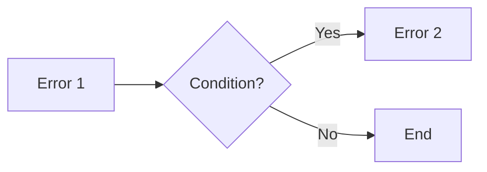

# Basic Concepts

Understand the core concepts of autosubmit-scan.

**For unfamiliar terms, see the [Glossary](../GLOSSARY.md).**

## Error Catalog

An [error catalog](../GLOSSARY.md#catalog) is a [YAML](../GLOSSARY.md#yaml) configuration file that tells the tool what errors to search for and where to find them:

```yaml
version: "1.0.0"
errors:
  oom_error:
    id: "oom_error"
    pattern:
      type: "literal"
      pattern: "OOM killed"
    files:
      - "/var/log/**/*.out"
    meaning: "Job ran out of memory"
    suggestion: "Increase memory allocation"
```

## Pattern Matching

[Pattern matching](../GLOSSARY.md#pattern-matching) is how the tool searches for errors in your [log files](../GLOSSARY.md#log-file). Three types:

1. **[Literal](../GLOSSARY.md#literal-pattern)**: Exact text matching (e.g., find "Error 404")
2. **[Regex](../GLOSSARY.md#regex-pattern)**: Flexible patterns (e.g., find "Error" followed by any number)
3. **[Callable](../GLOSSARY.md#callable-pattern)**: Custom Python function for complex logic

**Most users start with literal patterns** and only use regex/callable when needed.

## Railway Pattern

The [Railway Pattern](../GLOSSARY.md#railway-pattern) is an automatic error flowchart system. When the tool finds one error, it automatically checks for related errors based on [conditions](../GLOSSARY.md#condition) you define.

**Analogy:** Like a medical diagnosis flowchart - symptom → test → diagnosis.



## Smart Caching

The tool uses [Snakemake](../GLOSSARY.md#snakemake) (a workflow management tool) working behind the scenes to:
- Run scans in parallel (faster)
- Only re-scan files that changed (smart caching)
- Handle failures gracefully

**You don't need to learn Snakemake** - you interact with the tool through the `as-scan` command.

## Next Steps

- [Run your first scan](quickstart.md)
- [Learn pattern matching](../tutorials/02_pattern_matching.md)
